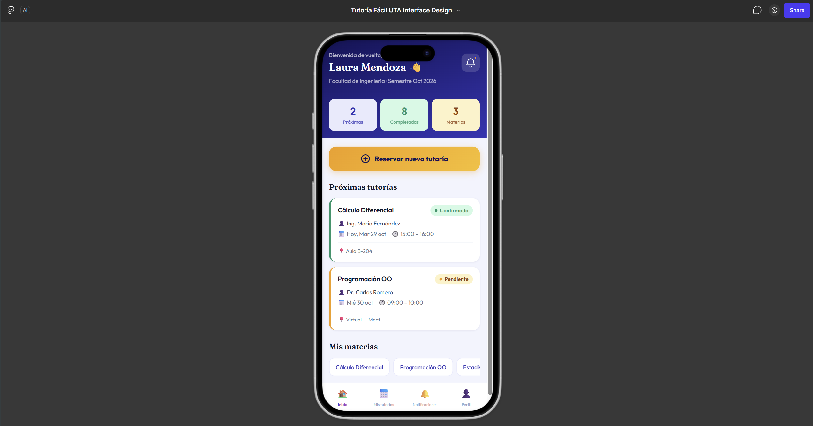
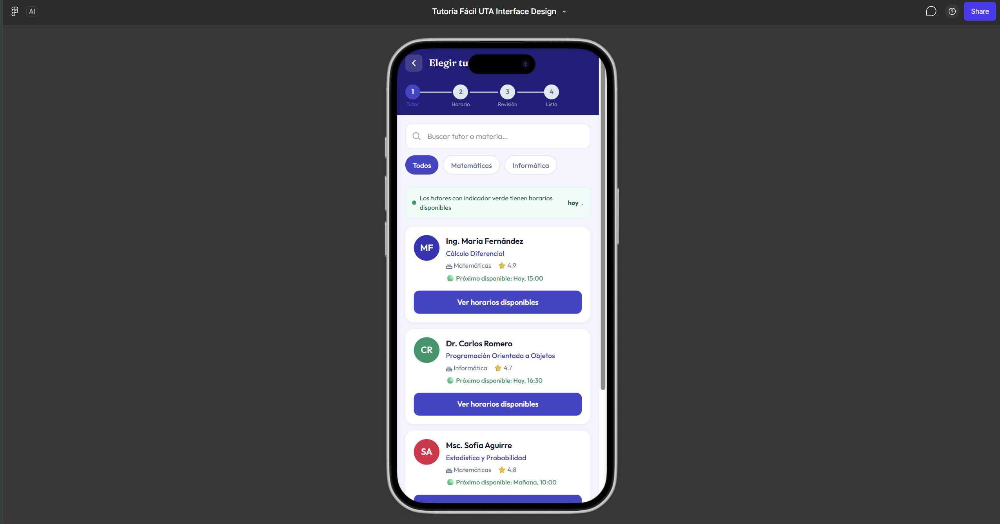
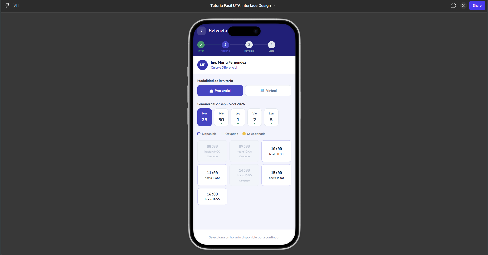
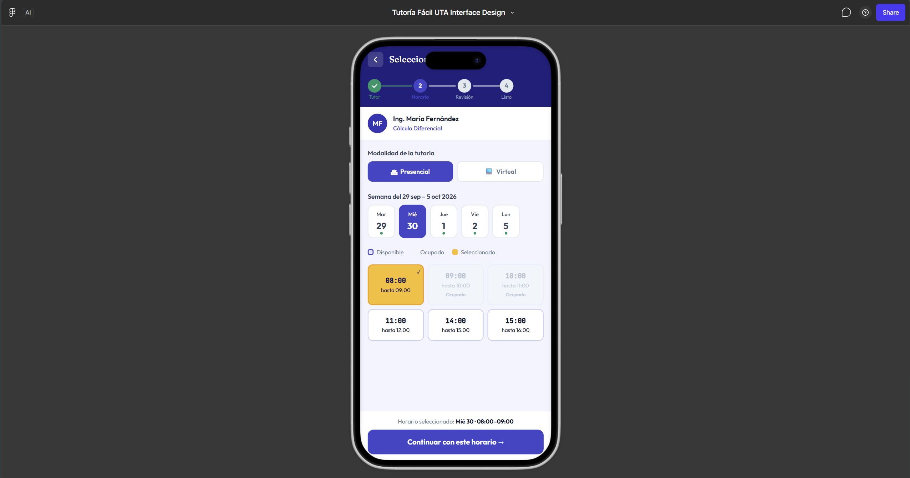
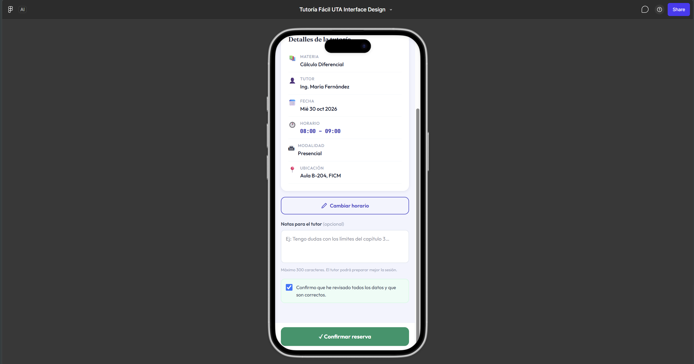
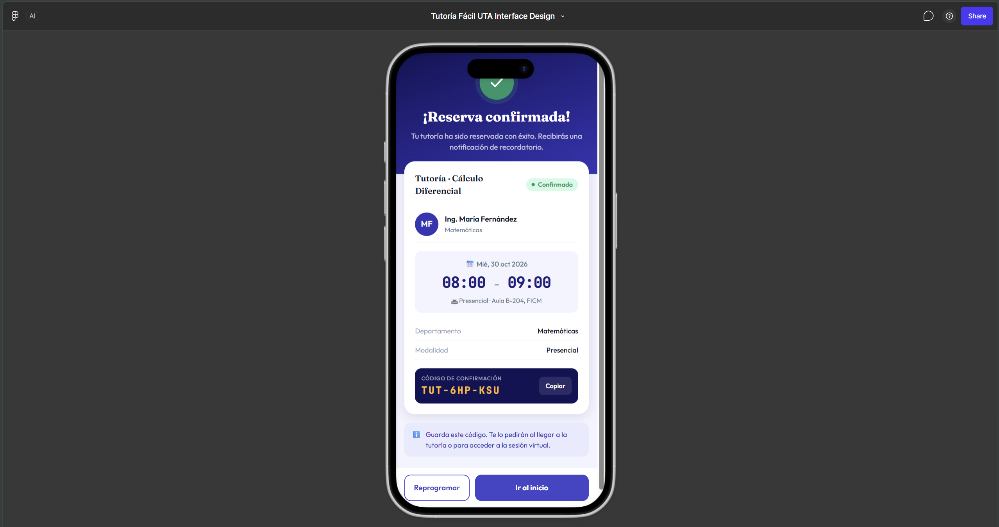

# Tutoría Fácil UTA · Grupo 3

Examen práctico integrador del primer parcial de Interacción Humano Computador.

## Problema

Las tutorías se coordinan por WhatsApp, hojas de cálculo y agendas personales. Obtener una confirmación toma en promedio 14 minutos y 9 mensajes, hay confirmaciones ambiguas, intentos de reservar horarios ocupados y citas olvidadas porque la confirmación se pierde entre otros mensajes.

Reto: diseñar una aplicación web móvil para consultar disponibilidad, reservar, confirmar y reprogramar una tutoría.

## Integrantes

| Nombre | Usuario GitHub | Rol | Issue | Rama |
|---|---|---|---|---|
| Juan Carvajal | @JuanJo2005 | Analista DCU | #1 | feature/juan-analisis-dcu |
| Erick Lopez | @ErickAloy871 | Diseño y accesibilidad | #2 | feature/erick-diseno-accesibilidad |
| Mauricio Guevara | @Mauri10G | Prototipado y evaluación | #3 | feature/mauricio-prototipo-evaluacion |

## Enlaces

- Tablero FigJam del análisis: https://www.figma.com/board/6rpIF3LlNkCT5dHo1fnHIe/Grupo-3-Tutoria-Facil-UTA-Analisis
- Prototipo navegable en Figma: https://www.figma.com/make/89sVTYj9izhS943JTMSiDz/Tutor%C3%ADa-F%C3%A1cil-UTA-Interface-Design
- Detalle del prototipo: [prototipo/enlace_prototipo.md](prototipo/enlace_prototipo.md)

## Evidencias

| Actividad | Responsable | Archivo |
|---|---|---|
| Matriz humano sistema | Juan Carvajal | [docs/01_matriz_ihc.pdf](docs/01_matriz_ihc.pdf) |
| Usabilidad y accesibilidad | Erick Lopez | [docs/02_usabilidad_accesibilidad.pdf](docs/02_usabilidad_accesibilidad.pdf) |
| DCU y contexto | Juan Carvajal | [docs/03_dcu_contexto.pdf](docs/03_dcu_contexto.pdf) |
| Decisiones de diseño y guía de estilo | Erick Lopez | [docs/04_decisiones_diseno.pdf](docs/04_decisiones_diseno.pdf) |
| Prototipo | Mauricio Guevara | [prototipo/enlace_prototipo.md](prototipo/enlace_prototipo.md) |
| Prueba e iteración | Mauricio Guevara | [evaluacion/prueba_iteracion.md](evaluacion/prueba_iteracion.md) |

## Estructura del repositorio

- `docs/` PDF del análisis IHC, usabilidad, DCU y decisiones de diseño
- `prototipo/` capturas de las pantallas y `enlace_prototipo.md`
- `evaluacion/` `prueba_iteracion.md` con la prueba cruzada y la mejora

## Prototipo

| Inicio | Elegir docente | Horario |
|---|---|---|
|  |  |  |

| Resumen | Confirmada | Reprogramar |
|---|---|---|
|  |  |  |

## Resumen de la prueba e iteración

Pendiente de la prueba cruzada. El detalle queda en [evaluacion/prueba_iteracion.md](evaluacion/prueba_iteracion.md).

## Flujo de trabajo

Cada integrante trabaja en su rama, hace al menos dos commits y abre un pull request que revisa otro compañero antes de fusionar con main.

| Integrante | PR propio | Revisa |
|---|---|---|
| Juan Carvajal | Pendiente | PR de Mauricio |
| Erick Lopez | Pendiente | PR de Juan |
| Mauricio Guevara | Pendiente | PR de Erick |
