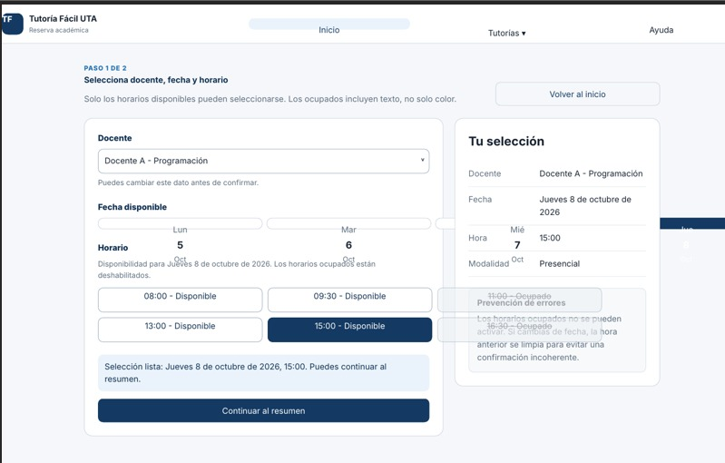

# Participación como evaluador del grupo 4

Como parte de la prueba cruzada, Mauricio Guevara del grupo 3 probó el prototipo del grupo 4 sin recibir explicaciones. A cambio, una persona del grupo 4 probó el prototipo del grupo 3, registrado en [prueba_iteracion.md](prueba_iteracion.md).

| Campo | Resultado |
|---|---|
| Prototipo evaluado | Tutoría Fácil UTA del grupo 4, versión HTML |
| Evaluador | Mauricio Guevara, grupo 3 |
| Tarea | Reservar una tutoría para el jueves y luego cambiar el horario |
| Completó la reserva | Sí |
| Completó el cambio | Sí |
| Tiempo aproximado | 30 s |
| Acciones o toques | 10 |
| Satisfacción de 1 a 7 | 6 |
| Observación | En la pantalla de horario los botones de fecha se superponen, el jueves queda cortado a la derecha y los horarios ocupados 11:00 y 16:30 se montan sobre el panel Tu selección |
| Comentario | El flujo es claro, no cambiaría nada del recorrido |

Los resultados se entregaron al grupo 4 para su iteración.
